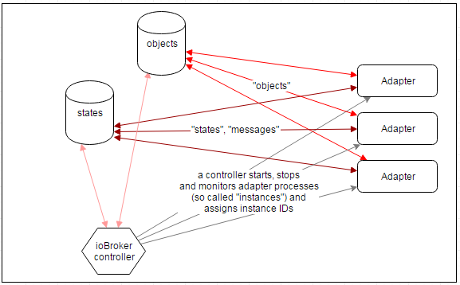

# ioBroker

=====================

*Automate your life!*

See [ioBroker wiki](https://github.com/ioBroker/ioBroker/wiki/Home-(English)) for more information

[ioBroker website](http://iobroker.net)
[Demo admin](http://iobroker.net:8081)
[Demo VIS](https://iobroker.net:8080)
[Forum](http://forum.iobroker.net)
[Whiteboard](https://trello.com/b/q0SZKdfW)
[Statistics](http://download.iobroker.net/stat.html)

ioBroker is an integration platform for the [Internet of Things](http://en.wikipedia.org/wiki/Internet_of_Things),
focused on Building Automation, Smart Metering, Ambient Assisted Living, Process Automation, Visualization and
Data Logging. It like a software f.e. [fhem](http://fhem.de), [OpenHAB](http://www.openhab.org/) or
[the thing system](http://thethingsystem.com/).

## Concept

ioBroker is not just an application, it's more of a a concept, a database schema, and offers a very easy way for systems
to interoperate. ioBroker defines some common rules for a pair of databases used to exchange data and publish events
between different systems.

#### Databases

ioBroker uses "in memory" database to hold the data and saves it on disk with resonable intervals. There are two types of
storage:
- states (values)
- objects (meta/configuration information)

States can be stored in "in memory" or in redis. Objects can be stored only in "in memory" DB.

[Redis](http://redis.io/) is an in-memory key-value data store and also a message broker with publish/subscribe pattern.
It's used to maintain and publish all states of connected systems.

#### Adapters

Systems are attached to ioBrokers databases via so called adapters, technically processes running anywhere
in the network and connecting all kinds of systems to ioBrokers databases. A connection to ioBrokers databases can be
implemented in nearly any programming language on nearly any platform and an adapter can run on any host that is able to
reach the databases via ip networking.

A library module for fast and comfortable adapter development exists for Javascript/Node.js until now. Libraries for
adapter development in other languages are planned (python, java, perl, ...).

See actual list of adapters on [iobroker.net](http://iobroker.net)

#### Security

ioBroker is designed to be accessed by trusted adapters inside trusted networks. This means that usually it is not a
good idea to expose the ioBroker databases, adapters or any smarthome devices directly to the internet or, in general,
to an environment where untrusted clients can directly access these network services. Adapters that offer services
supposed to be exposed to the internet should be handled with care. You should always activate **HTTPS** and use valid
certificates for web, admin if open it for internet or for example use it with additional security measures like VPN,
VLAN and reverse proxies.

## Getting Started

#### Operating System and Hardware

[ioBroker.js-controller](https://github.com/iobroker/ioBroker.js-controller/) should run on any hardware and os that runs
[Node.js](http://nodejs.org/) (ARM, x86, Windows, Linux, OSX). Binary builds for Redis are also available
for the ARM and x86 under Windows, Linux and OSX. Although redis is not required if it is not high load system.
ioBroker spawns a new Node.js-Process for every adapter instance, so
RAM becomes is a limiting factor. A single adapters memory fingerprint is roundabout 10-60MB. Since CouchDB can create
quite a lot of load a dual core system is beneficial.

We recommend x86 based or ARM based systems like [BananaPi](http://www.bananapi.org/p/product.html) or
[Cubietruck](http://www.exp-tech.de/Mainboards/ARM/Cubietruck.html) using Debian based Linux as operating system.

#### Installation and first steps

* automated installation packages for windows and linux coming soon
* [ioBroker.net](http://iobroker.net) => Installation

#### Community support

* get help in the [ioBroker Forums](http://forum.iobroker.net) (english, german and russian languages)

## Docs for (adapter-)developers

* [Core Concepts and Database Schema](doc/SCHEMA.md)
* [Example Javascript/Node.js Adapter](https://github.com/ioBroker/ioBroker.template)
* [ioBroker styleguides](doc/STYLE.md)
* [ioBroker.nodejs Changelog](https://github.com/ioBroker/ioBroker.js-controller/blob/master/CHANGELOG.md)
* [ioBroker.nodejs Roadmap](https://github.com/ioBroker/ioBroker.js-controller/blob/master/ROADMAP.md)

## License
This module is distributer under the MIT License (MIT). Please notice, that other ioBroker adapters can have different licenses.

Copyright (c) 2014-2017 bluefox<dogafox@gmail.com>,

Copyright (c) 2014      hobbyquaker

Permission is hereby granted, free of charge, to any person obtaining a copy
of this software and associated documentation files (the "Software"), to deal
in the Software without restriction, including without limitation the rights
to use, copy, modify, merge, publish, distribute, sublicense, and/or sell
copies of the Software, and to permit persons to whom the Software is
furnished to do so, subject to the following conditions:

The above copyright notice and this permission notice shall be included in
all copies or substantial portions of the Software.

THE SOFTWARE IS PROVIDED "AS IS", WITHOUT WARRANTY OF ANY KIND, EXPRESS OR
IMPLIED, INCLUDING BUT NOT LIMITED TO THE WARRANTIES OF MERCHANTABILITY,
FITNESS FOR A PARTICULAR PURPOSE AND NONINFRINGEMENT. IN NO EVENT SHALL THE
AUTHORS OR COPYRIGHT HOLDERS BE LIABLE FOR ANY CLAIM, DAMAGES OR OTHER
LIABILITY, WHETHER IN AN ACTION OF CONTRACT, TORT OR OTHERWISE, ARISING FROM,
OUT OF OR IN CONNECTION WITH THE SOFTWARE OR THE USE OR OTHER DEALINGS IN
THE SOFTWARE.

